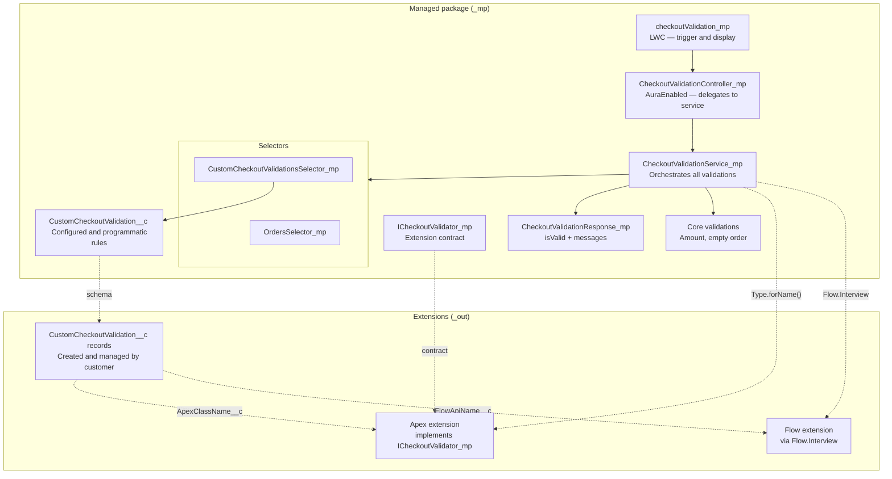

```mermaid
flowchart TD
    subgraph mp["Managed package (_mp)"]
        LWC["checkoutValidation_mp<br>LWC — trigger and display"]
        CTRL["CheckoutValidationController_mp<br>AuraEnabled — delegates to service"]
        SVC["CheckoutValidationService_mp<br>Orchestrates all validations"]
        RESP["CheckoutValidationResponse_mp<br>isValid + messages"]
        CORE["Core validations<br>Amount, empty order"]
        IFACE["ICheckoutValidator_mp<br>Extension contract"]
        subgraph selectors["Selectors"]
            ORDS["OrdersSelector_mp"]
            CCVS["CustomCheckoutValidationsSelector_mp"]
        end
        OBJ["CustomCheckoutValidation__c <br> Configured and programmatic rules"]
    end

    subgraph out["Extensions (_out)"]
        APEX["Apex extension<br>implements ICheckoutValidator_mp"]
        FLOW["Flow extension<br>via Flow.Interview"]
        DATA["CustomCheckoutValidation__c records<br>Created and managed by customer"]
    end

    LWC --> CTRL
    CTRL --> SVC
    SVC --> RESP
    SVC --> CORE
    SVC --> selectors
    SVC -.->|"Type.forName()"| APEX
    SVC -.->|"Flow.Interview"| FLOW
    CCVS --> OBJ
    OBJ -.->|"schema"| DATA
    DATA -.->|"ApexClassName__c"| APEX
    DATA -.->|"FlowApiName__c"| FLOW
    IFACE -.->|"contract"| APEX
```